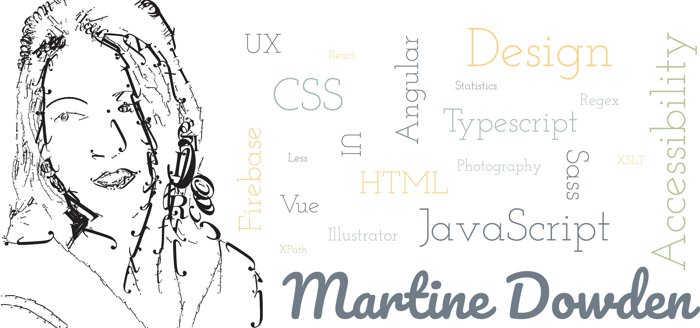

# Martine Dowden

*GDE & MVP, She/Her/They*

Focusing on web interfaces that are beautiful, functional, accessible, and usable I approach User Experience from both Art and Science, drawing from my  degrees in Psychology and Visual Communications.

## What I've been up too

- :speech_balloon: Speaking at conferences ([When and where](https://martine-dowden.github.io/portfolio/speaking))
- :book: Finished writing [Approachable Accessibility: Planning for Success](https://www.apress.com/gp/book/9781484248805)
- :mask: Developing a social distancing app: [Queue Saver](https://queuesaver.com/)
- :satellite: Co-Organizing [GDG Indy](https://www.meetup.com/gdg-indy/)

## Fun Facts
- :floppy_disk: my faavorite language is CSS
- I run on :coffee: and :cookie:
- I much prefer the cold :fallen_leaf: :jack_o_lantern: :snowflake: :snowflake:
- I :heart: my pet :tropical_fish:

## Find me on the web

- :microscope: learning and experimenting with code and other stuff on [twitter](https://twitter.com/Martine_Dowden)
- :hammer: tinkering in [Codepen](https://codepen.io/martine-dowden)
- :notebook: sharing my projects and conference slides on [martine.dev](http://martine.dev/)

<!--
**martine-dowden/martine-dowden** is a ✨ _special_ ✨ repository because its `README.md` (this file) appears on your GitHub profile.

Here are some ideas to get you started:

- 🔭 I’m currently working on ...
- 🌱 I’m currently learning ...
- 👯 I’m looking to collaborate on ...
- 🤔 I’m looking for help with ...
- 💬 Ask me about ...
- 📫 How to reach me: ...
- 😄 Pronouns: ...
- ⚡ Fun fact: ...
-->
